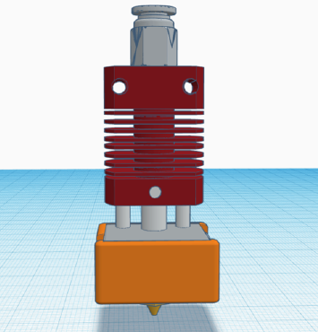
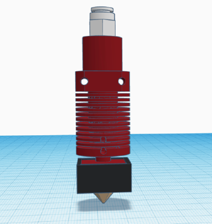
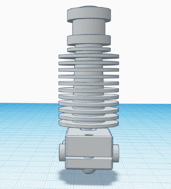
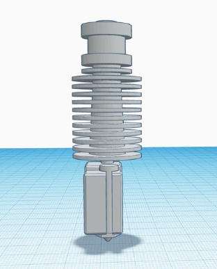
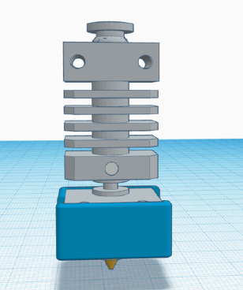
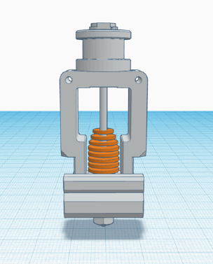
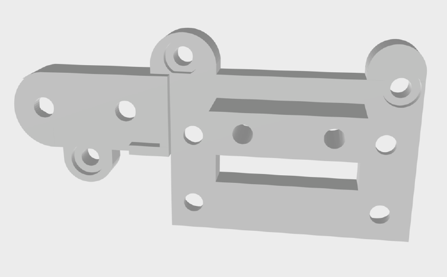
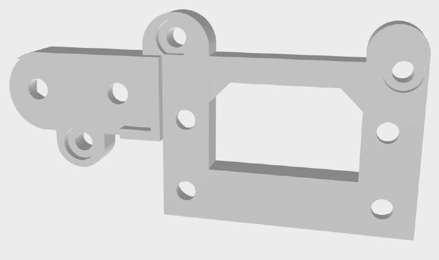

# [ITA] - Hero Me Gen 5

Benvenuto questa è una guida per il sistema di raffreddamento [Hero Me Gen 5](https://www.thingiverse.com/thing:4460970).

#### Nota Bene: questa guida si baserà su una Ender 3 Pro, ma il sistema Hero Me Gen 5 permette fino a 2 milioni di combinazioni.

Le istruzioni di seguito ti aiuteranno a selezionare le parti necessarie per la tua stampante e ti guideranno attraverso
la stampa, l'assemblaggio e la configurazione del sistema di raffreddamento.

### Modelli supportati

Di seguito è riportato l'elenco in continua crescita di stampanti 3D compatibili con Hero Me Gen5.
I cloni di altri produttori delle stampanti della serie Creality CR ed Ender potrebbero essere compatibili ma non sono stati testati. 
Con 72 parti in 6 categorie, ci sono oltre 2 milioni combinazioni!

- CR-10
- CR-10 V2
- CR-10 Mini
- CR-10S
- CR-10S4
- CR-10S5
- CR-10S Pro
- CR-10S Pro V2
- CR-20
- CR-MAX 
- Ender 3
- Ender 3X
- Ender 3 V2
- Ender 3 Pro
- Ender 5
- Ender 5 Pro
- Ender 5 Plus
- BLV Ender 3 Pro Upgrade
- Inoltre il kit MDD (Modular Direct Drive) di [PrinterMods.com](https://printermods.com/products/direct-drive-mod-for-creality-ender-3-cr-10) versione 1.2 e 1.3 per CR-10, Ender 3 ed Ender 5 è altrettanto compatibile.

### Riferimento incrociato delle parti

Avrai bisogno delle seguenti informazioni della tua stampante per selezionare le parti corrette.

Obbligatori | Opzionali
------------ | -------------
Modello stampante | Tipo di sensore ABL (se presente)
Tipo di hotend | Tipo di estrusore (da utilizzare con il kit MDD per Direct Drive Hero Me)
Ventole e dimensioni | -

**Nota importante:** spesso si vedranno riferimenti ad alcuni hotend definiti come "stile V6" o "cloni V6", per chiarire queste 
istruzioni, "stile V6" si riferisce specificamente al Creality OEM hotend per CR-10S Pro (V1, V2, etc)
che hanno una camera di fusione rotonda rossa, sono montati sulla piastra dell'asse X con due bulloni M3.
Questo stile di hotend si monta nello stesso modo e nella stessa posizione dell'hotend OEM di Ender 3 e del Micro Swiss di terze parti.

### Ecco i rendering dei vari hotend supportati da Hero Me Gen 5:

Nome | Immagini
------------ | -------------
Creality OEM | 
Creality V6 Style - CR-10S Pro.PNG | 
E3D V6 or Clone | 
E3D Volcano or Clone | 
Micro Swiss | 
Mosquito | 

### Adattatore Gantry (vedi glossario)

Esistono due tipi di *adattatore gantry*, un tipo supporta gli hotend Creality OEM, Mk8 e Micro Swiss, 
l'altro tipo viene utilizzato per gli hotend E3D V6, Mosquito etc.

OEM, Mk8, Micro Swiss, Creality V6 Style  | E3D V6, Volcano, Mosquito
------------ | -------------
 | 

Inizia con la tua stampante, trova il tuo modello di stampante dall'elenco sottostante e annota anche quale hotend
in uso per selezionare l'adattatore gantry giusto per la stampante.
Inoltre potrebbe esser necessario stampare 2 parti invece che 2.

